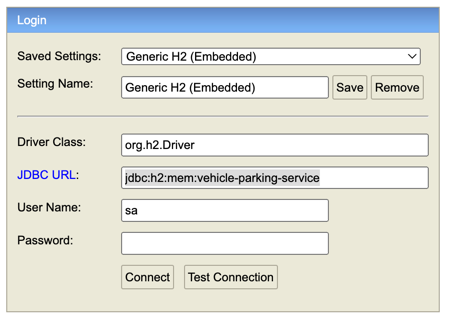
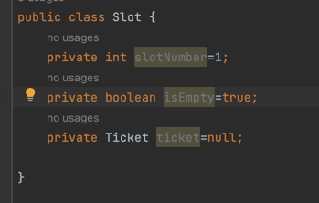
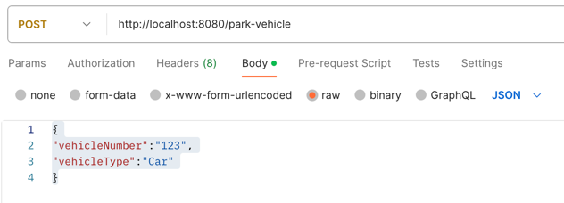
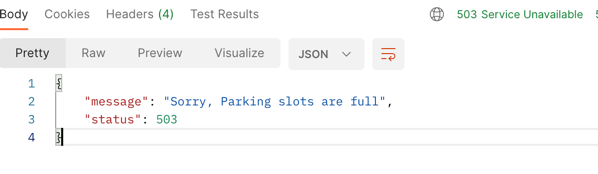
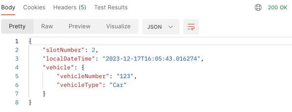
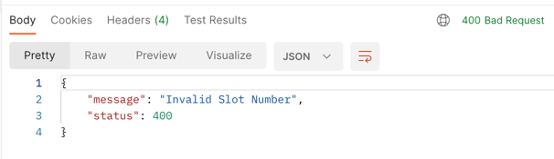
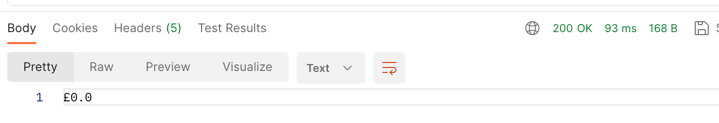

# vehicle-parking-service

Development server Navigate to http://localhost:8080/.

Technology Stack :
-----------------

* Java 17
* Spring Boot version 3.2.0
* Apache Maven
* H2 db (H2 console available at '/h2-console'. Database available at 'jdbc:h2:mem:vehicle-parking-service')
    * user name : sa
    * password : ""

* 

Slot Entity
------------

Note :
------
Initially app loads 100 slots Along with their 
@slotNumber, @isEmpty(By defaults value as TRUE), Ticket =null

Parking request will take Vehicle information and allocates the available slot.
Also gives you a ticket.

Parking Request
-------

@POST
http://localhost:8080/park-vehicle

**Sample Request (Vehicle Information)**

{
"vehicleNumber":"123",
"vehicleType":"Car"
}

1. Request takes Vehicle information
2. If it finds any available slot it's going to create a ticket using slot number and it sets IsEmpty=false
3. Ticket also contains check in time and vehicle information
4. If in case not slots available it throws ParkingFullException.
5. It Returns Ticket finally.
6. If slots are full it throws below error

**Ticket Information as Response**

Un-Parking Request
------------------

@PUT
http://localhost:8080/un-park-vehicle/{slotNumber}

In order to un-park your car you have to submit un-park request
and you need to pass your slot number. 

1. Using slot number it will  fetch the ticket information of that slot
2. It Calculates the rate per hour and returns it
3. It Stores the invoice information in db
4. De-allocates the slot and set's isEmpty=True
5. If in case given slot information is invalid it throws InvalidSlotException 

Response

Invoice Request 
---------------
@Get All Invoices
http://localhost:8080/invoice

@Get Invoice
http://localhost:8080/invoice/{invoiceId}

